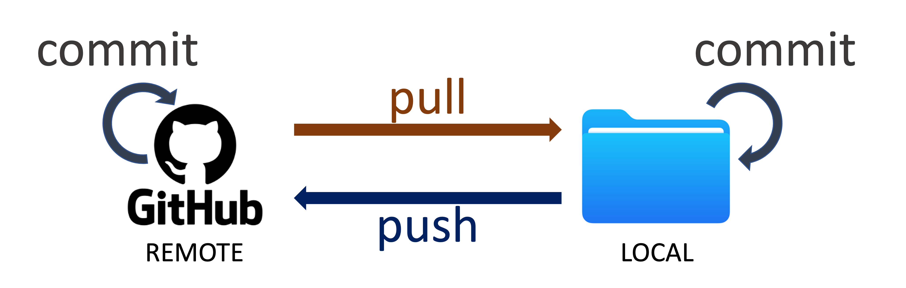
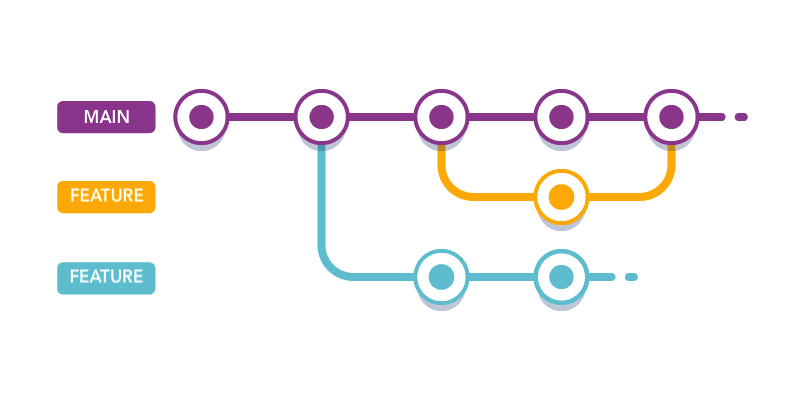

# GitHub Desktop fundamentals

## What you will practice

By the end of this lesson, you should be able to:

1. explain the difference between Git and GitHub;
2. distinguish a local repository from its remote copy;
3. make, commit, push, and pull a change in GitHub Desktop;
4. use a branch and pull request for collaborative work;
5. recognize a merge conflict and inspect it before choosing a resolution.

## Why use version control?

Suppose two people edit the same file, or you overwrite code that worked yesterday. A folder full of names such as `analysis_final_v2_really-final.ipynb` will not tell you what changed or why.

Git records snapshots of a project's files. Each snapshot, or commit, has a message and a place in the project's history. You can inspect earlier versions, compare changes, and return to a known state without keeping a pile of duplicate folders.

Google Docs has a version history for one document. Git applies the same basic idea to a project containing code, data instructions, documentation, and other text files.

## Git and GitHub are different

Git is the version-control software. GitHub hosts remote Git repositories and adds a web interface for collaboration, review, and publishing.

A **repository** is the project folder Git tracks. It contains the current files plus the history stored in its hidden `.git` directory.

- The **local repository** is on your computer.
- The **remote repository** is hosted elsewhere, usually on GitHub in this course.

The two copies do not synchronize automatically:

1. **Commit** records selected local changes with a message.
2. **Push** sends local commits to GitHub.
3. **Pull** brings remote commits to your local repository.

## Personal workflow

When you are the only person working in a repository, you will often commit directly to the `main` branch. The basic loop is:

1. inspect the changed files;
2. write a short commit message that explains the change;
3. commit locally;
4. push the commit;
5. check GitHub to confirm that it arrived.

### Create a repository

You can start in either place:

- **GitHub.com:** create a repository and select **Add a README file**. This creates the remote repository. Clone it in GitHub Desktop to create the local copy.
- **GitHub Desktop:** select **Current Repository -> Add -> Create New Repository** and initialize it with a README. This creates the local repository. Select **Publish repository** to create the remote copy.

### Practice the loop

1. Create a repository under your account.
2. Add a file named `text.txt` with one or two lines of text.
3. Open GitHub Desktop and inspect the change.
4. Commit it with a message that says what you added.
5. Push the commit.
6. Open the repository on GitHub and find the file.

Question: At which step did the change become part of local history? At which step did it reach GitHub?

## Collaborative workflow

When several people share a repository, use branches to keep unfinished work away from `main`.

A **branch** is another line of development inside the same repository. A **fork** is a separate copy of someone else's repository under another GitHub account. Team members with access to the same repository usually use branches. Outside contributors often use forks.

### Fork and clone the practice repository

1. Fork this [Git Playground](https://github.com/macss-berkeley/git-playground) to your account.
2. In GitHub Desktop, select **File -> Clone Repository**.
3. Select your fork and choose a local folder you can find again.
4. If GitHub Desktop asks how you plan to use the fork, select **To contribute to the parent project**.
5. Read the playground README. Do not edit `conflicts/team_plan.md` until the merge-conflict exercise.

### Make a branch and pull request

This first branch exercise is intentionally conflict-free.

1. Select **Current Branch -> New Branch** and use a descriptive name such as `add-river-contributor-note`.
2. In `contributors/`, copy `example.md` to a new file named with your GitHub username, such as `river.md`.
3. Replace the placeholders in your file. Do not edit another student's file, the repository README, or the conflict fixture.
4. Inspect the diff and commit the change on your branch.
5. Select **Publish branch**, then **Preview Pull Request**.
6. Confirm that the base branch is `main`, the compare branch is yours, and only your contributor file changed.
7. Select **Create Pull Request**, then write a title and short description in the browser.
8. Ask a teammate to inspect the **Files changed** tab and explain what they would approve or request before merging.

A pull request is a review conversation around a proposed merge. It does not automatically make the code correct.

## Practice a controlled merge conflict

A conflict occurs when Git cannot combine changes automatically, often because two branches edited the same lines. In this exercise, you will create a small conflict deliberately so you can recognize and resolve it without risking project work.

Complete the branch exercise first, then work in your own fork:

1. Commit any current work. Switch to `main`, select **Fetch origin**, and pull if GitHub Desktop reports remote changes.
2. Create a branch named `conflict-option-a` from `main`.
3. Open `conflicts/team_plan.md` and replace only the line beginning `Review rule:` with one concrete rule. Save, inspect, and commit the change.
4. Switch back to `main` without merging option A. Create a second branch named `conflict-option-b` from the same `main` commit.
5. Replace the same `Review rule:` line with a different rule, then commit it.
6. Switch to `main`. Select **Current Branch -> Choose a branch to merge into main**, choose `conflict-option-a`, complete the merge, and push your fork's `main`.
7. Switch to `conflict-option-b`. Select **Current Branch -> Choose a branch to merge into conflict-option-b**, then choose `main`. GitHub Desktop should report a conflict in `conflicts/team_plan.md`.
8. Open the repository in VS Code. Read both versions between `<<<<<<<`, `=======`, and `>>>>>>>`. Edit the file into the single final rule you actually want and remove every conflict marker.
9. Save the file. When GitHub Desktop reports that all conflicts are resolved, continue the merge and inspect the resulting commit.
10. Push `conflict-option-b`, open a pull request into your fork's `main`, and ask a teammate to verify that the final rule is coherent and contains no conflict markers.

Do not resolve a conflict by choosing a side blindly. The correct result may keep one version, combine both, or replace both. After resolving a code conflict, rerun the relevant check. If a notebook conflicts, stop and coordinate with the other editor: `.ipynb` files are structured JSON and are much harder to merge safely than Markdown or Python files.

Question: What evidence shows that your resolution preserved the intended work from both branches?

## Removing repositories and branches

These actions discard information, so verify the target first.

- Removing a repository from GitHub Desktop does not necessarily delete its local folder.
- Deleting the hidden `.git` directory removes local Git history but leaves the visible project files.
- Deleting the entire project folder removes both files and local history.
- Deleting a remote repository happens under **Settings -> Danger Zone** on GitHub and cannot be undone through the normal interface.
- A merged branch can usually be deleted after confirming that its commits are on `main`.

## What to remember

- A commit records local history; a push transfers commits to a remote.
- Inspect changes before committing or resolving a conflict.
- Pull before starting shared work, especially when teammates may have pushed changes.
- Use a branch and pull request when the change needs review before it reaches `main`.
